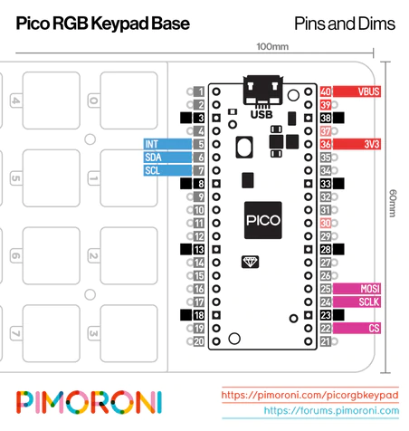
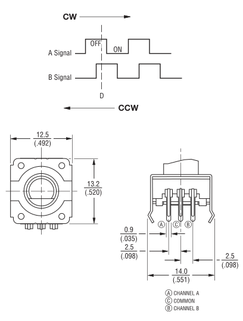
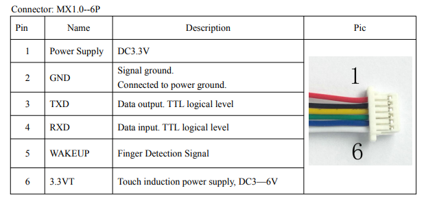
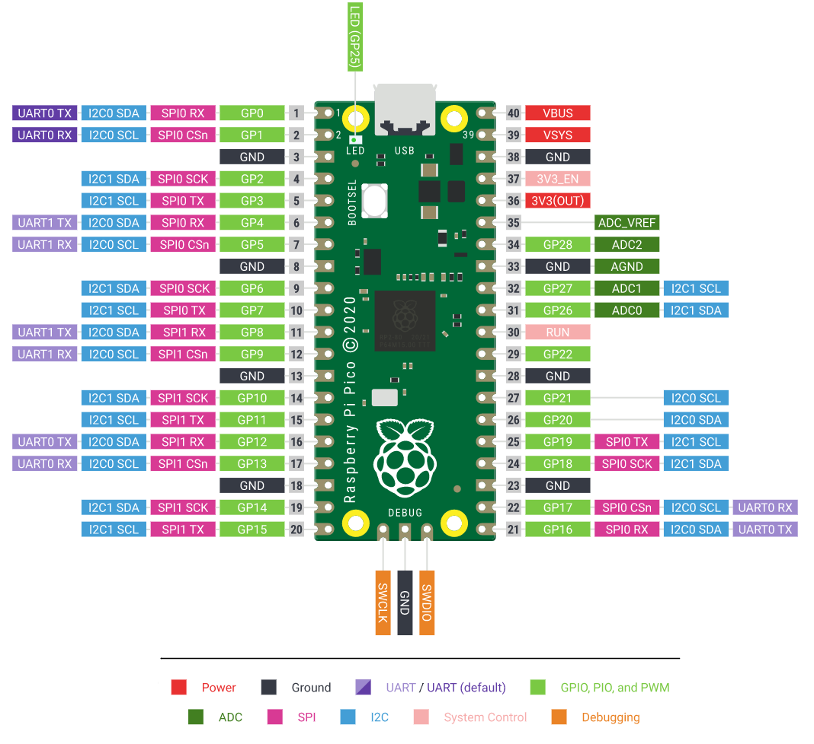
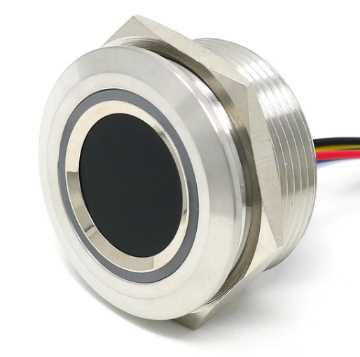

# pico-macro-keyboard2

## 14th June 2022 ##
After some late-night messing about last night with an old arduino uno, I managed to run an LED colour changing example for the R503 - which convinced me that it was 3.3V, it wasn't dead and it was soldered correctly.


I moved back to the PICO but using UART1 on pins GP8 and GP9

Green cable(green from sensor) into pico 11
Blue cable (yellow from sensor) into pico 12

The pico recognised the sensor and I could change the LED colour to purple.


I still don't really understand why UART1 doesn't work - but I've half an idea that that is in use by MU to access the REPL.
It would make sense that an UNO needs to use software serial to access the sensor (not in pass-thru mode) because it only have 1 hardware serial
The pico has 2 UARTs - I would guess one is in use for REPL, one can connect to the sensor.

### Back to the keypad ###



Looks like the UART pins I want are free.

Looking at the schematic - the LEDs are powered from VBUS (5V), there is an IO expander powered from the 3v3, so that will compete for power with the fingerprint reader.

### Rotary Encoder ###

Not used one of these before (tended to just use potentiometers)

https://www.adafruit.com/product/377

One side has a 3 pin connector (ground and two coding pins) and the other side has two pins for a normally open switch.

```
Connect Trinket's ground to the rotary encoder's common pin.
Connect Trinket's pin #0 to the rotary encoder's "A" signal pin.
Connect Trinket's pin #2 to the rotary encoder's "B" signal pin.

These encoder signals will be "active-low". Each of these signals is a switch inside the rotary encoder. Active-low means the other end of the switch is connected to ground, such that when the switch is "closed", the pin value will read low. We will be using the Trinket's internal pull-up resistors so when the switch is "open", the pin value will read high.
```



#### Adding a button ####
```
The button switch is connected to Trinket's pin #1. It is "active-high", meaning when the button is pressed, the pin will read as logic high. When the button is not pressed, the pin will read as logic low. (the built-in LED of the Trinket shares pin #1, the LED acts as a pull-down resistor)
```

#### Testing on the pico ####

Used the code in RotaryEncoder\Demo1\code copy.py.
No libraries needed copying in. rotaryio is native.

Can detect +1 and -1 for clockwise and anticlockwise.

Three wires onto 33, 32 and 31 (aGND, board.GP26, board.GP27)

Very simple.

## 13th June 2022 ##

I didn't have any luck out of the box using the pi pico I had setup already, so I'm going to set it up again from scratch.

https://learn.adafruit.com/getting-started-with-raspberry-pi-pico-circuitpython/circuitpython


CircuitPython 7.3.0 .UF2

Reboot holding button.
Drag and drop new .uf2 file.


```Traceback (most recent call last):
  File "code.py", line 24, in <module>
  File "adafruit_fingerprint.py", line 120, in __init__
  File "adafruit_fingerprint.py", line 136, in verify_password
  File "adafruit_fingerprint.py", line 348, in _get_packet
RuntimeError: Failed to read data from sensor
```


Checking wiring



There was an intermittent connection on the ground wire. I resoldered all the wires, but still nothing by the same error.

```
// For UNO and others without hardware serial, we must use software serial...
// pin #2 is IN from sensor (GREEN wire)
// pin #3 is OUT from arduino  (WHITE wire)
// Set up the serial port to use softwareserial..
SoftwareSerial mySerial(2, 3);
```
Green wire (green all the way) into pin 3
Blue wire (yellow) into pin 2

I have an arduino sketch which can control the LED ring.

It doesn't work using hardware serial on an UNO - does UNO not have hardware support?

Does the pico?


https://docs.circuitpython.org/projects/fingerprint/en/latest/api.html#adafruit_fingerprint.Adafruit_Fingerprint.set_led





Going to have a look at the keypad for a bit.

https://dronebotworkshop.com/pi-pico-circuitpython/

### pimoroni pico rgb keypad base ###

https://github.com/pimoroni/pmk-circuitpython

You'll need to grab the latest version of Adafruit's Raspberry Pi Pico-flavoured CircuitPython, from the link below.

Download the Adafruit CircuitPython binary for Raspberry Pi Pico

Unplug your Pi Pico's micro USB cable, press and hold the BOOTSEL button on the top of Pi Pico while plugging the micro USB cable back into your computer to mount it as a drive (it should show up as RPI-RP2 or something similar).

Drag and drop the adafruit-circuitpython-raspberry_pi_pico-en_US-XXXXX.uf2 file that you downloaded onto the drive and it should reboot and load the CircuitPython firmware. The drive should now show up as CIRCUITPY.

The Adafruit DotStar LED driver library for CircuitPython is a prerequisite for this Keybow 2040 library, so you'll need to download it from GitHub at the link below, and then drop the adafruit_dotstar.py file into the lib folder on your CIRCUITPY drive.


- Reflashed Pico with latest 7.3.0 circuit python firmware
- Added \lib\adafruit_dotstar.py
- Added \lib\pmk
- renamed reactive.py to code.py
- commented out one line and enabled ``from pmk.platform.rgbkeypadbase import RGBKeypadBase as Hardware``

Lights up keys as you press them. Just works.


## 12th June 2022 ##

Prototype Panel Mount Fingerprint Sensor with Bi-Colour LED Ring (R503) (THE PI HUTSKU: 104474) with the pico.



https://github.com/adafruit/Adafruit_CircuitPython_Fingerprint

https://learn.adafruit.com/adafruit-optical-fingerprint-sensor
https://learn.adafruit.com/adafruit-optical-fingerprint-sensor/circuitpython


On the "rugged" fingerprint sensor:

Red wire is connected to 3.3V for power
Black wire is connected to ground
Yellow to Microcontroller TX (data out from microcontroller)
Green to Microcontroller RX (data in from microcontroller)

```There are two I2C peripherals available, I2C0 and I2C1, two SPI peripherals, SPI0 and SPI1, and two UART peripherals, UART0 and UART1. You can assign any of these to the pins on which they are available. So for example, you can use GP0/GP1 for I2C0, and simultaneously use GP2/GP3 for I2C1, but you cannot use GP0/GP1 together with GP4/GP5 for I2C use, because they are both usable only with I2C0.```

In CircuitPython, you don't need to specify exactly which peripheral is used. As long you choose valid pins, CircuitPython will choose a free peripheral.```

To setup a UART bus, you specify the TX and RX pins. Be sure to use the UARTx pins and not the similarly named SPIx ones.

```
import board
import busio

uart = busio.UART(tx=board.GP4, rx=board.GP5)
```

I think:
Sensor yellow to 6
Sensor green to 7
Sensor red to 36
Sensor black to 38

Downloaded the version 6 circuit python bundle (not sure if the keypad supports 7 yet)?
Downloaded the version 7 circuit python bundle - let's push on.

